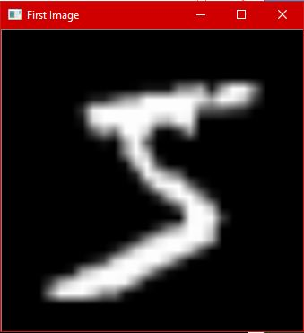
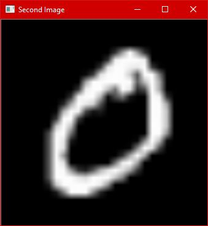
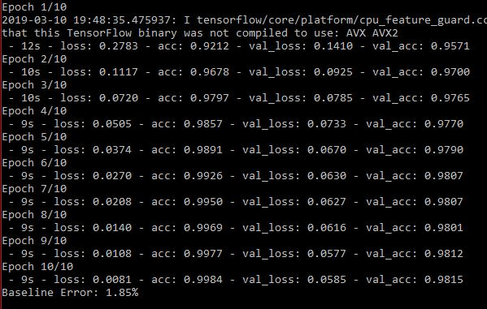

# Handwritten Digit Recognition

Making and training a Neural Networks model (using keras) to recognize handwritten digits.

Currently the model gives an accuracy of **98.18%** which can be improved upto **99.8%** using more complex *Convolutional Neural
Networks*(CNN). Right now I've used a really simple neural network since I've got to learn more about *CNN*s. So, I'll be improving 
this project in the near future.

***

### Sample of Images You Are Dealing With

* First image in the dataset

* Second image in the dataset

***

## Required Libraries

* `pandas`
* `keras`
* `numpy`
* `matplotlib`

***

## What You Should See

When you run the program using `python trainer.py` you should see the following if you already have the above libraries installed.

* Output

***

#### Note

You'll still have to feed a 28 by 28 pixel image to this model since it's not a robust model and does very little pre-processing on it's own. The images in the dataset are in the form of a 2D array which is stored in *numpy* arrays.
I hope to improve the model itself as well as the pre-processing in the future.